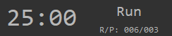

# What's it
A python tool to create tomato timer which using PySimpleGUI, pygame. PySimpleGUI is used to display timer. The pygame is used to play music.

- 记录运行和中断的次数
- 倒计时可通过配置文件 "PyTomato.json" 配置
- 双击倒计时部分关闭
